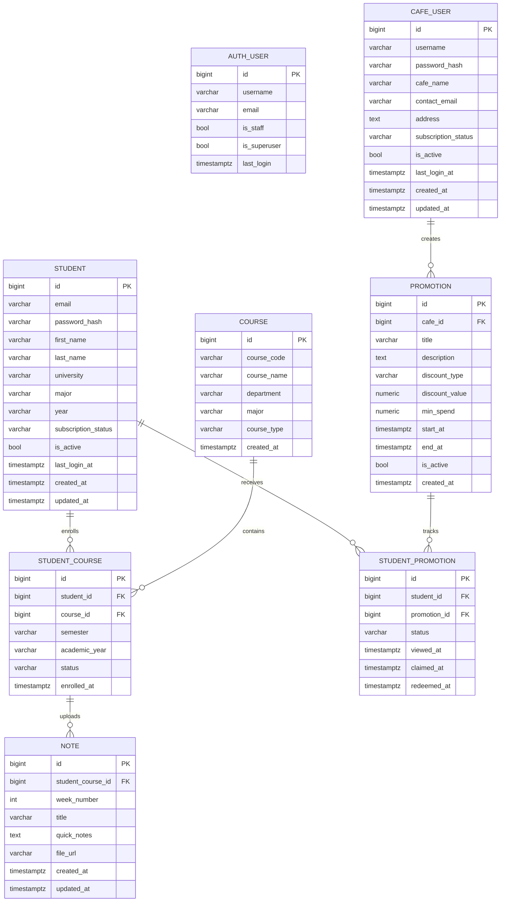

# LearnoFy ERD v2

This is a recommended v2 schema for LearnoFy based on the current backend direction:

- `public.auth_user` stays for Django admin/staff only.
- Student and cafe login data live in `app_data`, not in Django auth.
- Notes should move from string-only course fields to proper course enrollment links.
- Promotions remain part of the target design even though they are not fully implemented yet.

## Mermaid ERD

## Why This Is Better Than v1

- It removes the shared app-level `User` table, which matches your current backend decision.
- It keeps `public.auth_user` isolated for admin use only.
- It makes note uploads depend on a real course enrollment instead of duplicated text fields.
- It keeps promotions independent from auth and ties them directly to cafes.
- It avoids the old `StudentProfile` and `CafeProfile` split when each account already only serves one role.

## Recommended Constraints

- `STUDENT.email` should be unique.
- `CAFE_USER.username` should be unique.
- `COURSE.course_code` should be unique, or unique with `major` if codes repeat by program.
- `STUDENT_COURSE` should be unique on `(student_id, course_id, semester, academic_year)`.
- `STUDENT_PROMOTION` should usually be unique on `(student_id, promotion_id)`.
- `NOTE.week_number` should have a check constraint such as `1 <= week_number <= 16`.
- `PROMOTION` should have a check constraint that `end_at >= start_at`.

## Mapping To Your Current Backend

Already implemented now:

- `STUDENT`
- `CAFE_USER`
- `NOTE` as a simplified version stored in `app_data.notes`
- `AUTH_USER` in `public` for Django admin

Recommended next tables/migrations:

- `COURSE`
- `STUDENT_COURSE`
- `PROMOTION`
- `STUDENT_PROMOTION`
- Refactor `NOTE` so it references `student_course_id` instead of storing course metadata as loose text

## Implementation Notes

- In Django, keep admin on the built-in auth system unless you have a strong reason to replace it.
- For student and cafe auth, keep password hashes in their own tables as you are doing now.
- If you expect majors and departments to grow, make them reference tables in v3.
